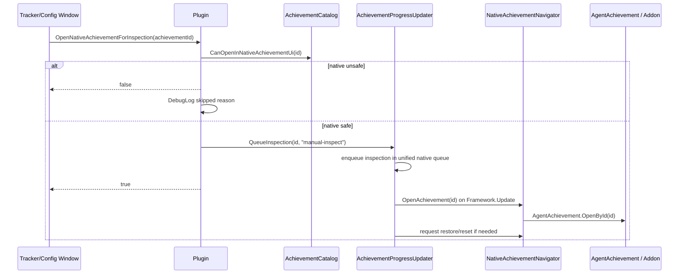
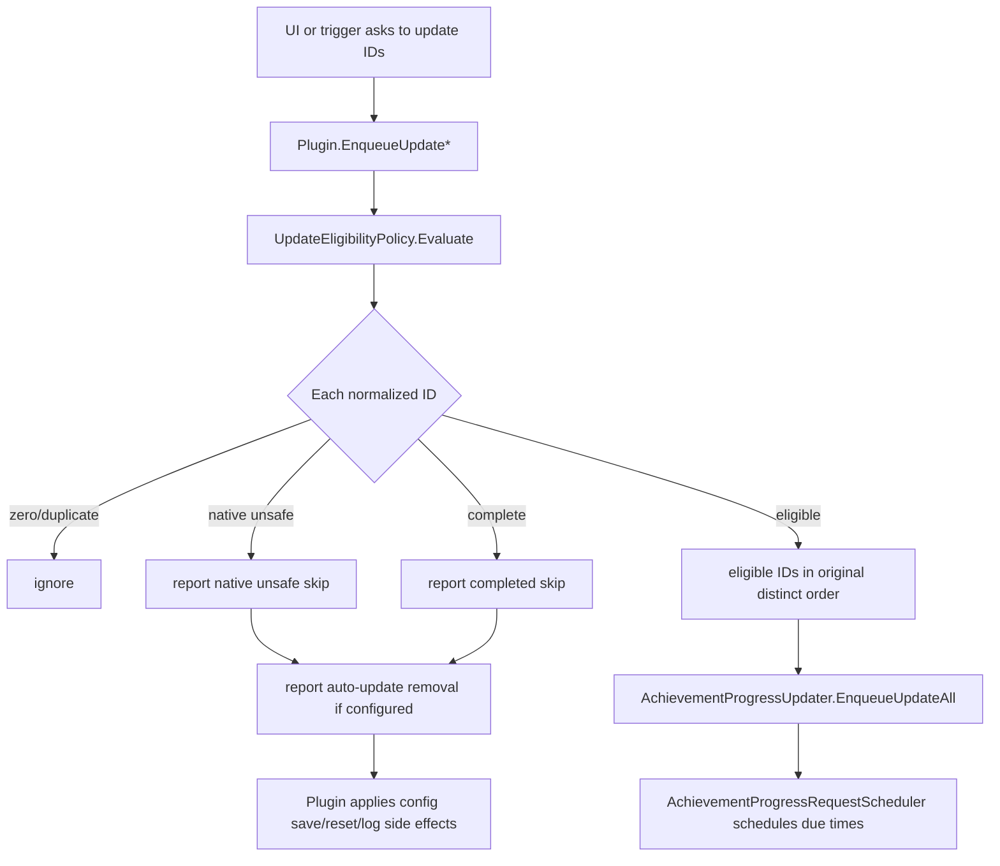
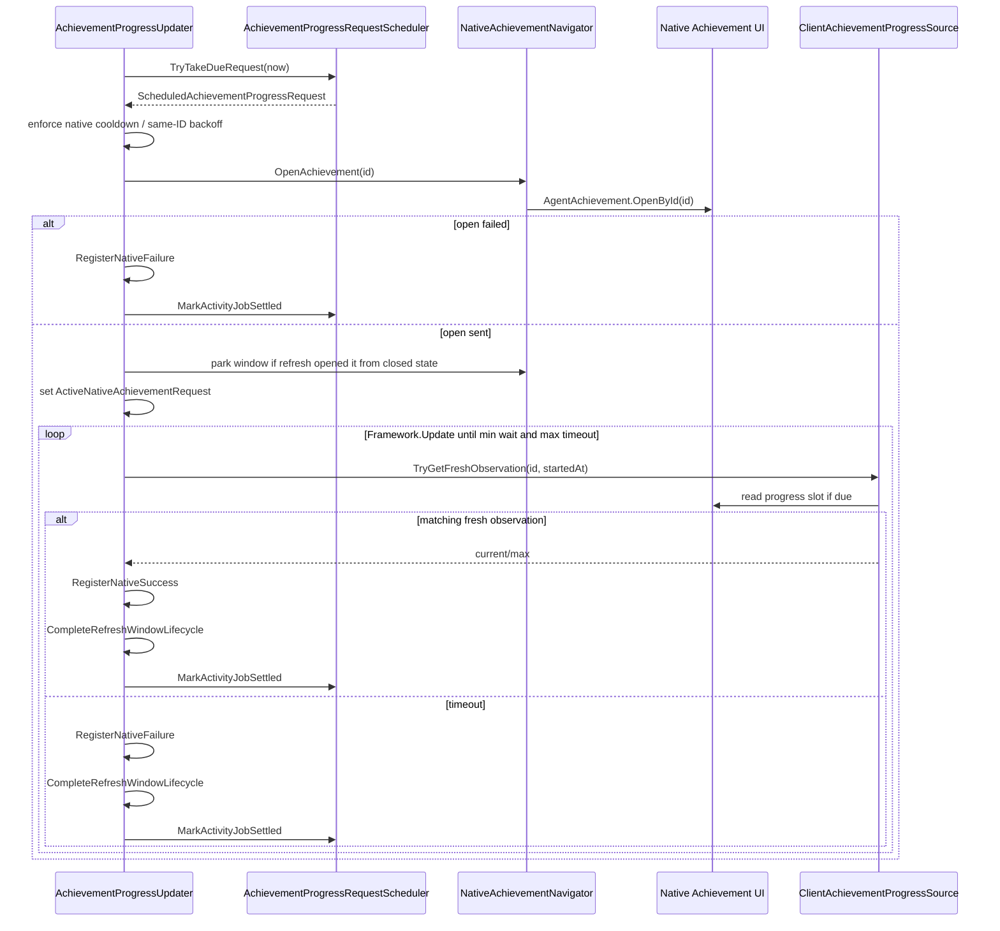
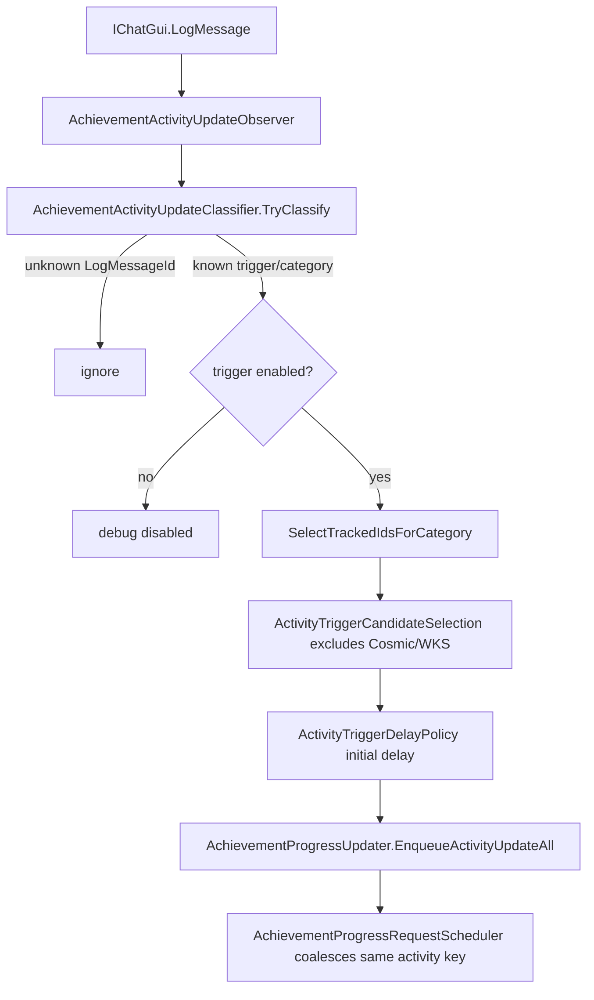
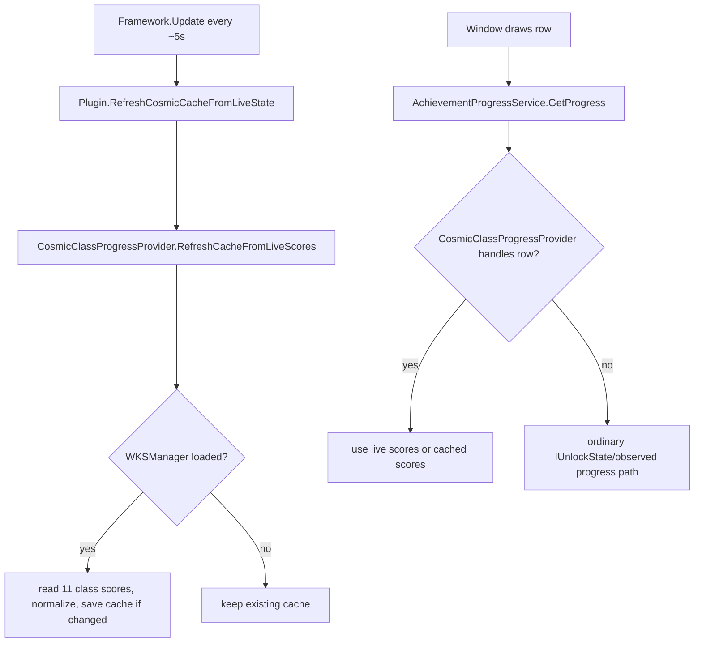
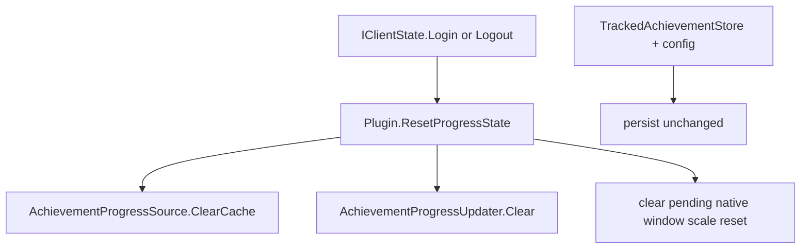

# Native Refresh Flow

This page documents the fragile native Achievement refresh/inspection flows. Keep it current whenever queueing, eligibility, native window parking, or progress observation changes.

## Manual row inspection

Purpose: user asks to open a specific native Achievement entry.

Notes:

- Inspection goes through the same serialized native queue as refreshes.
- `NativeAchievementNavigator` owns all direct native agent/addon calls.
- Inspection is user-visible and should restore parked native window state.

## Manual / timed / activity refresh enqueue

Purpose: choose eligible IDs and queue native Achievement refresh actions.

Semantic owners:

- `UpdateEligibilityPolicy` owns pure filtering and returned intent.
- `Plugin` owns config mutation, debug logging, and completion-observation side effects.
- `AchievementProgressUpdater` owns queue run state and native action lifecycle.
- `AchievementProgressRequestScheduler` owns spacing, dedupe, backoff, and dirty activity-key behavior.

## Refresh execution lifecycle

Purpose: execute one scheduled native refresh safely.

Key invariants:

- Native opens happen from `Framework.Update`, not directly from arbitrary UI draw logic.
- A refresh waits at least `RefreshMinimumWait` before accepting an observation.
- A refresh times out after `RefreshMaximumWait`.
- Repeated failures trip the native circuit breaker and clear pending native actions.
- Same-achievement backoff prevents rapid repeated opens for one ID.

## Activity-triggered refresh

Purpose: convert local craft/gather log events into scoped refreshes without broad text heuristics.

Key invariants:

- Use known `LogMessageId` classification, not broad text fallbacks.
- Same `(trigger, category)` bursts coalesce; different keys can still queue normally.
- Cosmic/WKS achievements are excluded because `CosmicClassProgressProvider` owns those progress values.

## Cosmic/WKS progress display

Purpose: show Cosmic class score progress without ordinary refresh requests.

Key invariants:

- WKS reads stay inside `CosmicClassProgressProvider`.
- Cosmic cache is persisted in plugin config.
- Cosmic achievements should not be routed through ordinary activity-trigger refresh candidates.

## Login/logout reset

Purpose: keep persisted tracking but clear session-only observed ordinary progress.

Key invariant: tracked IDs persist; observed ordinary progress does not.

## What not to add

- Do not add a second refresh queue/throttler.
- Do not bypass `UpdateEligibilityPolicy` for refresh candidates.
- Do not move native agent/addon calls out of `NativeAchievementNavigator`.
- Do not store native pointers across frames.
- Do not treat Cosmic/WKS progress as ordinary queue-refresh progress.
- Do not add direct progress/server requests unless the branch/user explicitly approves that experimental surface.
