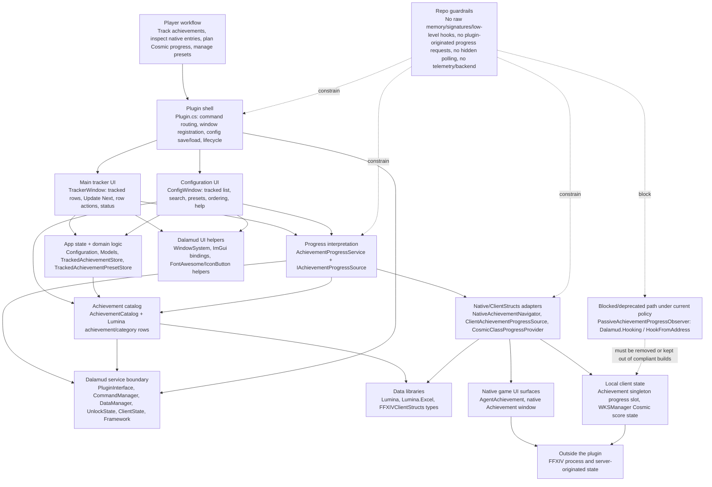

# Dalamud hierarchy model for Veela's Achievement Ledger

This page is a practical hierarchy of what actually exists in Veela's Achievement Ledger. It follows the plugin's real dependency shape instead of forcing a fixed number of layers. Read it as a dependency map: player-facing workflow sits at the top, plugin code and Dalamud services sit in the middle, and game-client/native state sits at the bottom.

The important rule of thumb: when work moves downward in this hierarchy, review risk goes up. Ordinary UI/domain changes are easy to reason about. ClientStructs/native adapters are policy-sensitive and must stay small, documented, and justified. Raw memory, signatures, and low-level hooks are now repo blockers.

## Version snapshot

Generated from this working tree and local Dalamud dev environment.

- Plugin project: `VeelasAchievementLedger`
- Plugin version: `0.2.0.18`
- Project SDK: `Dalamud.NET.Sdk/15.0.0`
- Package lock:
  - `DalamudPackager` resolved `15.0.0`
  - `DotNet.ReproducibleBuilds` resolved `1.2.39`
- Local Dalamud dev bundle commit: `8323fad04f174bd376812e750b9996ce4dc6a7f2`
- Local Dalamud runtime assembly: `Dalamud.dll` `15.0.2.0`
- Local component versions observed:
  - `Dalamud.Bindings.ImGui.dll`: assembly/file `1.0.0.0`, product `1.0.0+8323fad04f174bd376812e750b9996ce4dc6a7f2`
  - `Dalamud.Common.dll`: assembly/file `1.0.0.0`, product `1.0.0+8323fad04f174bd376812e750b9996ce4dc6a7f2`
  - `ImGuiScene.dll`: assembly/file `1.0.0.0`, product `1.0.0+8323fad04f174bd376812e750b9996ce4dc6a7f2`
  - `FFXIVClientStructs.dll`: assembly/file `7.51.0.8301`, product `1.0.0+5deef083b822c65f17bb64bbc3993c938fe4b743`
  - `Lumina.dll`: assembly `7.0.0.0`, file `7.5.0.0`, product `7.5.0+efef7038ddfe3036cc3ca36907be2771b009ca1d`
  - `Lumina.Excel.dll`: assembly `7.0.0.0`, file `7.4.4.0`, product `7.4.4-alpha.0.42+50d8017117d587b7975739c0c3e2ea7889e232dd`

## Do all provided components share one version?

Short answer: **no, not as a single assembly version.**

The project pins the build SDK/package surface at `Dalamud.NET.Sdk/15.0.0`, and the local dev bundle is one coherent Dalamud snapshot identified by commit `8323fad...`. Inside that bundle, different assemblies still report their own assembly/file/product versions. For example, `Dalamud.dll` reports `15.0.2.0`, `FFXIVClientStructs.dll` reports `7.51.0.8301`, and Lumina reports `7.x` versions.

For this repo, use these practical meanings:

- **Build/API contract:** `Dalamud.NET.Sdk/15.0.0` in `AchievementTracker.csproj`.
- **Packager contract:** `DalamudPackager 15.0.0` in `packages.lock.json`.
- **Local runtime/dev snapshot:** `/home/micheal/.xlcore/dalamud/Hooks/dev`, commit `8323fad...`, with `Dalamud.dll 15.0.2.0`.
- **Data/native helper libraries:** bundled assemblies such as Lumina and FFXIVClientStructs each carry separate versions.

## Hierarchy diagram



## Logical groups

### Player workflow

What the user experiences:

- Run `/val`.
- Track achievements.
- Open native Achievement entries from rows or search results.
- See completion/progress when the client has exposed enough local data.
- Save, load, rename, and delete tracked-list presets.
- Use Cosmic Class score information for planning when local score state is available.

This group is described by `README.md`, help text, button labels, and the UI pages. It should stay plain-English and should not expose internal implementation details unless they help the player understand risk or behavior.

### Plugin shell

Main file:

- `AchievementTracker/Plugin.cs`

Responsibilities:

- Own plugin construction and disposal.
- Load/normalize/save configuration.
- Register `/val` and subcommands.
- Register/unregister windows and Dalamud callbacks.
- Hold shared services used by UI windows.
- Apply shared lockouts for user-guided native Achievement opens.

Review focus:

- `Dispose()` must undo event subscriptions and release owned resources.
- Command behavior should match README/help.
- Long-running or per-frame work should not creep into this class without clear reason.

### UI windows

Files:

- `AchievementTracker/Windows/TrackerWindow.cs`
- `AchievementTracker/Windows/ConfigWindow.cs`

Responsibilities:

- Draw the main tracker.
- Draw config/search/preset/help UI.
- Convert button clicks into calls on `Plugin` or domain services.
- Keep player-facing text concise.

Review focus:

- UI code should not directly manipulate native pointers or perform heavy per-frame work.
- Buttons should do exactly what their labels/tooltips say.
- Config organization should stay navigable and maintainable.

### App state and domain logic

Files/classes:

- `AchievementTracker/Configuration.cs`
- `AchievementTracker/Models/*`
- `AchievementTracker/Services/TrackedAchievementStore.cs`
- `AchievementTracker/Services/TrackedAchievementPresetStore.cs`
- `AchievementTracker/Services/AchievementCatalog.cs`
- `AchievementTracker/Services/AchievementProgressService.cs`

Responsibilities:

- Store tracked achievement IDs and presets.
- Sanitize preset names and achievement IDs.
- Read achievement/category metadata through the catalog.
- Format progress/completion states for the UI.

Review focus:

- This is the safest place for tests.
- Keep this group mostly pure C# over config, models, Lumina rows, and `IUnlockState` results.
- Avoid making domain services know about ImGui or native game pointers.

### Dalamud service boundary

Injected/provided services currently used in `Plugin.cs`:

- `IDalamudPluginInterface`
- `ICommandManager`
- `IDataManager`
- `IUnlockState`
- `IClientState`
- `IFramework`
- `IGameInteropProvider` currently only exists for the blocked hook observer path and should be removed if that path is removed.

Responsibilities:

- Provide the plugin lifecycle, command registration, config storage, game data, unlock state, client state, and framework tick callbacks.

Review focus:

- Event subscriptions must be paired with unsubscriptions.
- `IFramework.Update` should stay minimal and should not become hidden gameplay automation.
- `IGameInteropProvider` usage is a red flag under the current blocker policy when it leads to hooks or native address binding.

### UI and data libraries

Libraries:

- `Dalamud.Bindings.ImGui`
- `Dalamud.Interface.Components`
- `Dalamud.Interface.Windowing`
- `Lumina`
- `Lumina.Excel`
- FFXIVClientStructs type definitions where needed by isolated adapters

Responsibilities:

- Draw windows and icon buttons.
- Read static sheet data.
- Provide typed access to selected native/game structures through ClientStructs.

Review focus:

- ImGui and Lumina use is ordinary plugin behavior.
- ClientStructs use should stay isolated below this group, not spread through windows or domain models.

### Native and ClientStructs adapters

Current files:

- `AchievementTracker/Services/NativeAchievementNavigator.cs`
- `AchievementTracker/Services/ClientAchievementProgressSource.cs`
- `AchievementTracker/Services/CosmicClassProgressProvider.cs`
- `AchievementTracker/Services/PassiveAchievementProgressObserver.cs` — **blocked/deprecated under current repo policy because it uses low-level hooks.**

Current responsibilities:

- `NativeAchievementNavigator`: open/close the native Achievement UI from explicit user actions.
- `ClientAchievementProgressSource`: read already-loaded local Achievement progress slot values.
- `CosmicClassProgressProvider`: read local WKS/Cosmic score state when available and use cached values otherwise.
- `PassiveAchievementProgressObserver`: currently hooks native callbacks; this conflicts with the current blocker rule and should not be part of a compliant build.

Review focus:

- Keep allowed adapters small and documented.
- Do not store raw pointers across frames.
- Do not add plugin-originated progress requests.
- Do not use raw memory, signatures, or low-level hooks.

### Native game-client surfaces

Native surfaces currently touched by adapters:

- `AgentAchievement.Instance()`
- `agent->OpenById(achievementId)`
- `agent->Hide()`
- `Achievement.Instance()`
- `Achievement.ProgressRequestState`
- `Achievement.ProgressAchievementId`
- `Achievement.ProgressCurrent`
- `Achievement.ProgressMax`
- `WKSManager.Instance()`
- `manager->State.Scores`

Blocked/deprecated native callback surfaces currently present in old code:

- `Achievement.Delegates.ReceiveAchievementProgress`
- `Achievement.Delegates.SetAchievementCompleted`
- `Achievement.MemberFunctionPointers.*`
- `HookFromAddress(...)`

Review focus:

- User-guided native UI open is the safest current native interaction pattern in this plugin.
- Local state reads are still sensitive and should be justified.
- Native hooks/signature/raw-memory paths are not allowed by current repo policy.

### Outside the plugin

This includes:

- FFXIV process state.
- Square Enix server-originated achievement/completion/progress state.
- Dalamud/XIVLauncher distribution and update channels.
- GitHub custom repository JSON and release assets.

Review focus:

The plugin must not add hidden server traffic, packet capture, synthetic addon actions, telemetry, backend sync, content ID collection, or arbitrary self-update behavior.

## Call placement examples

```text
/val command
Plugin shell: Plugin.OnCommand
Plugin shell: ToggleMainUi / OpenConfigUi
UI windows: WindowSystem draws TrackerWindow or ConfigWindow
```

```text
Configure button
UI windows: TrackerWindow.DrawConfigureButton
Plugin shell: Plugin.ToggleConfigUi
UI windows: ConfigWindow.Draw
```

```text
Tracked row reload icon / Update Next
UI windows: TrackerWindow row button or Update Next
Plugin shell: Plugin.OpenAchievementForUpdate applies shared lockout
Native adapter: NativeAchievementNavigator.OpenAchievement
Native game UI: AgentAchievement.OpenById
```

```text
Search result inspect button
UI windows: ConfigWindow search result row
Native adapter: NativeAchievementNavigator.OpenAchievement
Native game UI: AgentAchievement.OpenById
```

```text
Progress display
UI windows: row asks AchievementProgressService for display state
Domain logic: AchievementProgressService combines unlock/progress sources
Dalamud service: IUnlockState supplies known completion state
Native adapter: ClientAchievementProgressSource may read local progress slot
UI windows: row renders formatted status
```

```text
Cosmic Class score display
UI windows: tracked/search row asks for progress
Domain logic: AchievementProgressService delegates Cosmic Class rows
Native adapter: CosmicClassProgressProvider checks local WKSManager scores when available
App state: cached score fallback is used when live state is unavailable
```

## Review checklist by group

- Player workflow: wording is accurate, concise, and player-visible.
- Plugin shell: commands, config saves, lifecycle, and event unregistration are correct.
- UI windows: buttons match labels/tooltips and do not hide heavy/native work.
- App state/domain logic: pure logic has tests and remains separate from UI/native code.
- Dalamud service boundary: subscriptions are symmetric; framework ticks stay minimal and non-automating.
- UI/data libraries: ImGui/Lumina use is straightforward and does not perform surprising work per frame.
- Native adapters: allowed ClientStructs use is isolated, documented, and does not request progress or store pointers.
- Blocked paths: raw memory, signatures, and low-level hooks are absent from compliant builds; if needed, stop and inform Micheal/the user.
- Outside-plugin boundary: no hidden polling, backend calls, packet capture, telemetry, content ID collection, or arbitrary self-update behavior.
