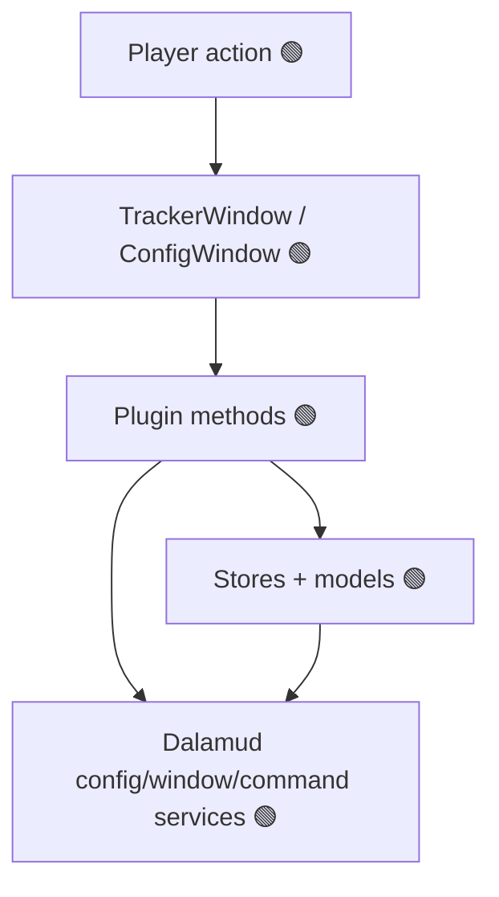
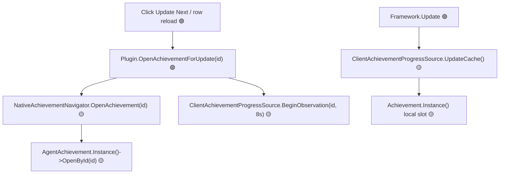
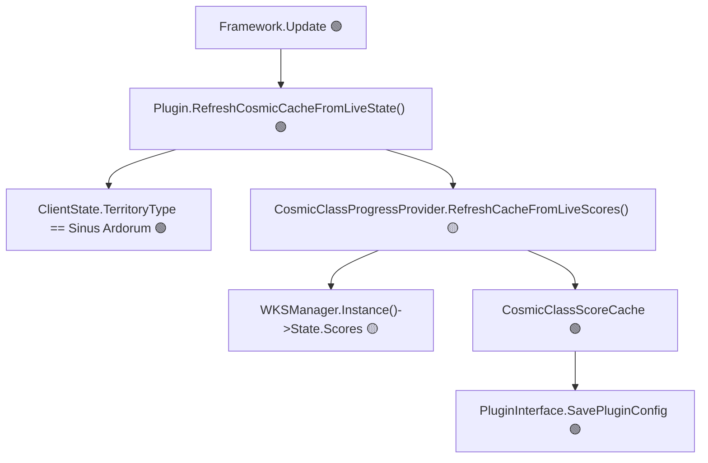
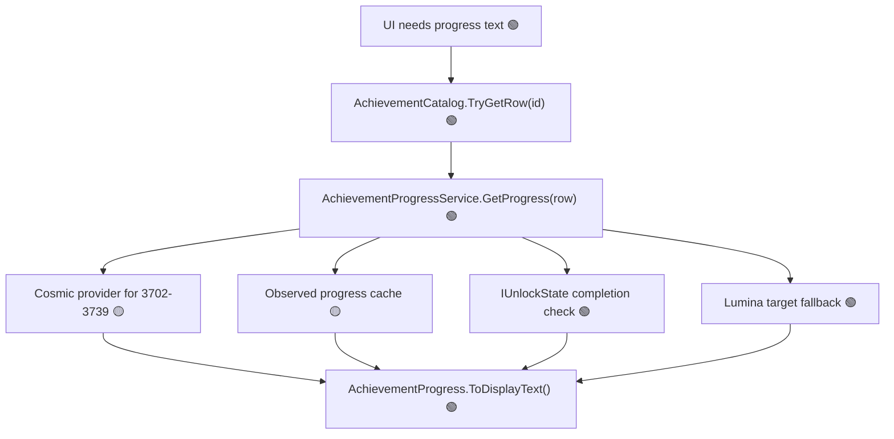
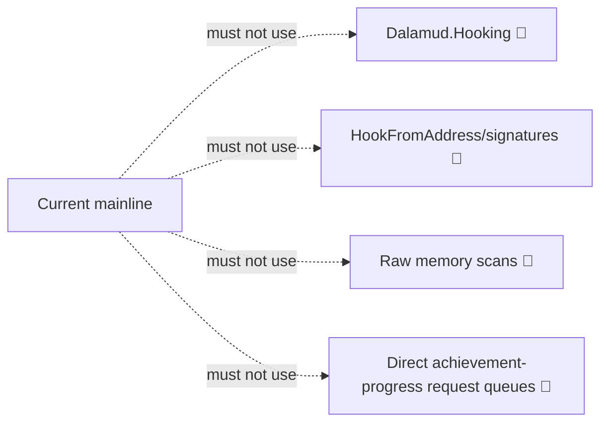

# Dalamud hierarchy model for Veela's Achievement Ledger

Version: `v0.2.0.22`

This page is a practical hierarchy of what actually exists in Veela's Achievement Ledger. The old single Mermaid diagram was too dense, so this version uses several smaller diagrams and a flat layer table.

## Rule of thumb

When a call moves downward in the hierarchy, review risk goes up:

- 🟢 Ordinary plugin code and supported Dalamud services/libraries are safe/expected surfaces.
- 🟡 ClientStructs/native adapters are policy-sensitive and must stay small.
- 🔴 Raw memory, signatures, low-level hooks, and direct achievement-progress request queues are blocked/deprecated for current mainline.

## Version snapshot

- Plugin project: `VeelasAchievementLedger`
- Plugin version: `0.2.0.22`
- Project SDK: `Dalamud.NET.Sdk/15.0.0`
- Package lock: `DalamudPackager 15.0.0`, `DotNet.ReproducibleBuilds 1.2.39`

The project SDK/package version is not the same thing as every local runtime assembly version. Dalamud, FFXIVClientStructs, Lumina, and ImGui bindings each report their own assembly/file/product versions.

## Layer table

```text
Layer A 🟢 Player workflow
  /val, Configure, Help, Update Next, row reload, inspect, close native window, search/add/remove/reorder, presets

Layer B 🟢 Plugin UI and command shell
  Plugin.OnCommand, TrackerWindow, ConfigWindow, WindowSystem registration

Layer C 🟢 Plugin domain/state
  Configuration, TrackedAchievementStore, TrackedAchievementPresetStore, AchievementProgress, AchievementInfo

Layer D 🟢 Data and progress interpretation
  AchievementCatalog, AchievementProgressService, Lumina Achievement rows, IUnlockState completion checks

Layer E 🟢 Dalamud service boundary
  IDalamudPluginInterface, ICommandManager, IDataManager, IUnlockState, IClientState, IFramework, UiBuilder

Layer F 🟡 Isolated native/ClientStructs adapters
  NativeAchievementNavigator, ClientAchievementProgressSource, CosmicClassProgressProvider

Layer G 🟡 FFXIV native/client state surfaces
  AgentAchievement, Achievement singleton progress slot, WKSManager.State.Scores

Layer X 🔴 Blocked/deprecated
  Dalamud.Hooking, HookFromAddress, signatures, raw scans, direct RequestAchievementProgress queues
```

## Diagram 1: normal UI/config flow



## Diagram 2: native Achievement open flow



## Diagram 3: Cosmic Class score/cache flow



## Diagram 4: progress display decision



## Blocked/deprecated diagram


