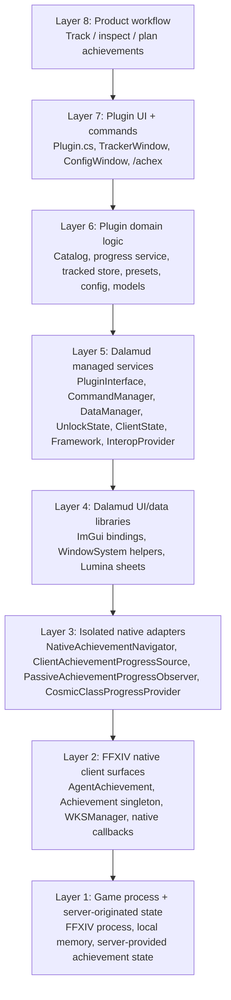

# Dalamud layer model for Achieve Ex+

This is an OSI-style mental model for the plugin: each layer is a lower-level system that the layer above depends on. The higher you go, the more the code is ordinary plugin/product logic. The lower you go, the closer the code is to Dalamud, ClientStructs, native game UI, or raw game state.

## Version snapshot

Generated from this working tree and local Dalamud dev environment.

- Plugin project: `AchieveExPlus`
- Plugin version: `0.2.0.17`
- Project SDK: `Dalamud.NET.Sdk/15.0.0`
- Package lock:
  - `DalamudPackager` resolved `15.0.0`
  - `DotNet.ReproducibleBuilds` resolved `1.2.39`
- Local Dalamud dev bundle commit: `8323fad04f174bd376812e750b9996ce4dc6a7f2`
- Local Dalamud runtime assembly: `Dalamud.dll` `15.0.2.0`
- Local component versions observed:
  - `Dalamud.Bindings.ImGui.dll`: assembly/file `1.0.0.0`, product `1.0.0+8323fad04f174bd376812e750b9996ce4dc6a7f2`
  - `Dalamud.Common.dll`: assembly/file `1.0.0.0`, product `1.0.0+8323fad04f174bd376812e750b9996ce4dc6a7f2`
  - `ImGuiScene.dll`: assembly/file `1.0.0.0`, product `1.0.0+8323fad04f174bd376812e750b9996ce4dc6a7f2`
  - `FFXIVClientStructs.dll`: assembly/file `7.51.0.8301`, product `1.0.0+5deef083b822c65f17bb64bbc3993c938fe4b743`
  - `Lumina.dll`: assembly `7.0.0.0`, file `7.5.0.0`, product `7.5.0+efef7038ddfe3036cc3ca36907be2771b009ca1d`
  - `Lumina.Excel.dll`: assembly `7.0.0.0`, file `7.4.4.0`, product `7.4.4-alpha.0.42+50d8017117d587b7975739c0c3e2ea7889e232dd`

## Do all provided components share one version?

Short answer: **no, not as a single assembly version.**

The project pins the build SDK/package surface at `Dalamud.NET.Sdk/15.0.0`, and the local dev bundle is one coherent Dalamud snapshot identified by commit `8323fad...`. Inside that bundle, different assemblies still report their own assembly/file/product versions. For example, `Dalamud.dll` reports `15.0.2.0`, `FFXIVClientStructs.dll` reports `7.51.0.8301`, and Lumina reports `7.x` versions.

For this repo, use these practical meanings:

- **Build/API contract:** `Dalamud.NET.Sdk/15.0.0` in `AchievementTracker.csproj`.
- **Packager contract:** `DalamudPackager 15.0.0` in `packages.lock.json`.
- **Local runtime/dev snapshot:** `/home/micheal/.xlcore/dalamud/Hooks/dev`, commit `8323fad...`, with `Dalamud.dll 15.0.2.0`.
- **Data/native helper libraries:** bundled assemblies such as Lumina and FFXIVClientStructs each carry separate versions.

## OSI-style layer diagram

```text
Layer 8 — Product intent / player workflow
  Achieve Ex+ behavior:
  track achievements, open native Achievement entries, show observed progress, manage presets/search/help.

Layer 7 — Plugin UI and commands
  AchievementTracker/Plugin.cs
  AchievementTracker/Windows/TrackerWindow.cs
  AchievementTracker/Windows/ConfigWindow.cs
  /achex command, ImGui windows, buttons, help text, local UI state.

Layer 6 — Plugin domain services and models
  AchievementCatalog, AchievementProgressService, TrackedAchievementStore,
  TrackedAchievementPresetStore, Configuration, Models/*.
  Mostly pure C# logic over plugin config and Lumina rows.

Layer 5 — Dalamud managed services
  IDalamudPluginInterface, ICommandManager, IDataManager, IUnlockState,
  IClientState, IFramework, IGameInteropProvider, WindowSystem.
  These are injected/provided by Dalamud and form the normal plugin API boundary.

Layer 4 — Dalamud UI/data libraries
  Dalamud.Bindings.ImGui, Dalamud Interface helpers, Lumina/Lumina.Excel.
  Used for drawing windows and reading game data sheets.

Layer 3 — ClientStructs/native adapters in this plugin
  NativeAchievementNavigator, ClientAchievementProgressSource,
  PassiveAchievementProgressObserver, CosmicClassProgressProvider.
  These are intentionally small and labeled with risk comments.

Layer 2 — FFXIV client native structures/agents/hooks
  AgentAchievement, Achievement singleton, WKSManager, native callback hooks.
  This is local client state/UI/native callback territory.

Layer 1 — Game process, local memory, and Square Enix servers
  FFXIV process and server-originated state.
  This plugin must not add hidden polling, synthetic game actions, telemetry, or backend calls.
```

## Mermaid hierarchy diagram



## Where our code lands

### Layer 8: product workflow

Plain-English behavior:

- Maintain a list of tracked achievements.
- Let the player open the native Achievement entry for a tracked achievement.
- Passively show progress when the client has exposed it.
- Save/load reusable tracked lists as presets.
- Show Cosmic Class score planning from locally observed score state.

Files:

- `README.md`
- `map/*`
- player-facing strings in `TrackerWindow.cs` and `ConfigWindow.cs`

Risk: low, unless wording misrepresents what lower layers are doing.

### Layer 7: plugin UI and command layer

Files/methods:

- `Plugin.OnCommand(...)`
- `Plugin.ToggleMainUi()` / `OpenMainUi()` / `OpenConfigUi()`
- `TrackerWindow.Draw()` and `Draw...` UI helpers
- `ConfigWindow.Draw()` and `Draw...` UI helpers

External components:

- Dalamud command manager
- Dalamud `WindowSystem`
- ImGui

Risk: low. The UI becomes higher-risk only where a button calls a native adapter.

### Layer 6: plugin domain logic

Files/classes:

- `Configuration.cs`
- `Models/*`
- `TrackedAchievementStore`
- `TrackedAchievementPresetStore`
- `AchievementCatalog`
- `AchievementProgressService`

External components:

- plugin config
- Lumina sheet rows through `IDataManager`
- Dalamud `IUnlockState` for known completion state

Risk: low. This layer should remain ordinary C# logic and is the safest place to add tests.

### Layer 5: Dalamud managed service boundary

Injected services in `Plugin.cs`:

- `IDalamudPluginInterface`
- `ICommandManager`
- `IDataManager`
- `IUnlockState`
- `IClientState`
- `IGameInteropProvider`
- `IFramework`

Our methods using this layer:

- `Plugin.RegisterDalamudCallbacks()`
- `Plugin.UnregisterDalamudCallbacks()`
- `Plugin.RefreshCosmicCacheFromLiveState()` uses `IClientState.TerritoryType` and `IFramework.Update` as a gate.
- `AchievementCatalog` uses `IDataManager`.
- `AchievementProgressService` uses `IUnlockState`.

Risk: low-to-medium. These are normal Dalamud plugin APIs, but `IFramework.Update` and `IGameInteropProvider` deserve extra review because they can become automation/hook surfaces if abused.

### Layer 4: UI/data support libraries

Libraries:

- `Dalamud.Bindings.ImGui`
- `Dalamud.Interface.Components`
- `Lumina`
- `Lumina.Excel`

Our methods using this layer:

- `TrackerWindow.Draw...` methods use ImGui and `ImGuiComponents.IconButton`.
- `ConfigWindow.Draw...` methods use ImGui and FontAwesome icon buttons.
- `AchievementCatalog` reads achievement/category sheet data.

Risk: low. UI and sheet reads are expected plugin behavior.

### Layer 3: isolated native adapters

Files/classes:

- `NativeAchievementNavigator`
- `ClientAchievementProgressSource`
- `PassiveAchievementProgressObserver`
- `CosmicClassProgressProvider`

What they do:

- Open/close the native Achievement UI.
- Read already-loaded local Achievement progress slot state.
- Hook native callbacks passively and call the original function first.
- Read local WKS/Cosmic score state for Cosmic Class planning.

Risk: medium to medium-high. This is where `unsafe`, hooks, pointers, native agents, and ClientStructs live. The refactor keeps these surfaces isolated and labeled.

### Layer 2: FFXIV native client surfaces

Native surfaces touched:

- `AgentAchievement.Instance()`
- `agent->OpenById(achievementId)`
- `agent->Hide()`
- `Achievement.Instance()`
- `Achievement.ProgressRequestState`
- `Achievement.ProgressAchievementId`
- `Achievement.ProgressCurrent`
- `Achievement.ProgressMax`
- `Achievement.Delegates.ReceiveAchievementProgress`
- `Achievement.Delegates.SetAchievementCompleted`
- `WKSManager.Instance()`
- `manager->State.Scores`

Risk: medium-high. These must stay small, reviewed, and well-commented.

### Layer 1: game process and server-originated state

This is below our plugin. The plugin sees local client state that the game already has, but should not add hidden traffic or automation.

Out-of-scope for this safe/readable architecture:

- hidden automatic progress polling
- broad background queues
- synthetic addon callbacks
- packet capture
- telemetry/backend calls
- content ID collection
- arbitrary DLL/plugin self-update behavior

Risk: highest. Avoid unless explicitly isolated as a private experiment and separately reviewed.

## Call placement examples

```text
/achex command
Layer 7: Plugin.OnCommand
Layer 7: ToggleMainUi / OpenConfigUi
Layer 7: WindowSystem draws UI
```

```text
Configure button
Layer 7: TrackerWindow.DrawConfigureButton
Layer 7: Plugin.ToggleConfigUi
```

```text
Tracked row reload icon
Layer 7: TrackerWindow.DrawRowUpdateButton
Layer 7: TrackerWindow.OpenNativeAchievementForUpdate
Layer 7: Plugin.OpenAchievementForUpdate
Layer 3: NativeAchievementNavigator.OpenAchievement
Layer 2: AgentAchievement.OpenById
```

```text
Passive observed progress
Layer 2: Native Achievement client callback occurs
Layer 3: PassiveAchievementProgressObserver.OnReceiveAchievementProgress
Layer 3: ClientAchievementProgressSource.RecordObservedProgress
Layer 6/7: AchievementProgressService / UI display reads cached value
```

```text
Cosmic Class score display
Layer 7: UI row asks for progress
Layer 6: AchievementProgressService.GetProgress
Layer 3: CosmicClassProgressProvider.GetProgress
Layer 2: WKSManager.Instance()->State.Scores, if loaded
Layer 6: cached score fallback if live state unavailable
```

## Review checklist by layer

- Layers 7-8: check wording, player UX, and whether buttons do only what they say.
- Layer 6: add/keep unit tests for stores, presets, and formatting.
- Layer 5: verify event subscriptions are paired with unsubscriptions.
- Layer 4: verify UI is not doing heavy work per frame.
- Layer 3: require explicit risk comments and small methods.
- Layer 2: verify native calls are user-guided or passive and do not synthesize actions.
- Layer 1: fail closed on hidden polling, backend calls, packet capture, or privacy-sensitive identifiers.
